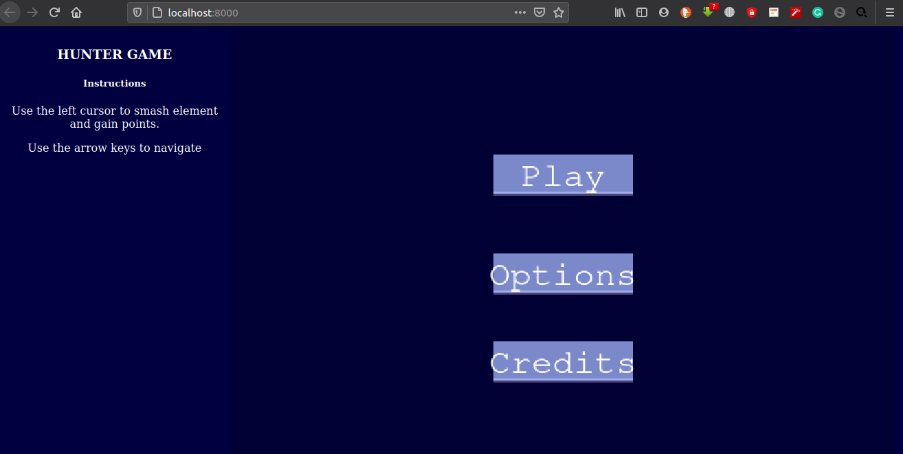
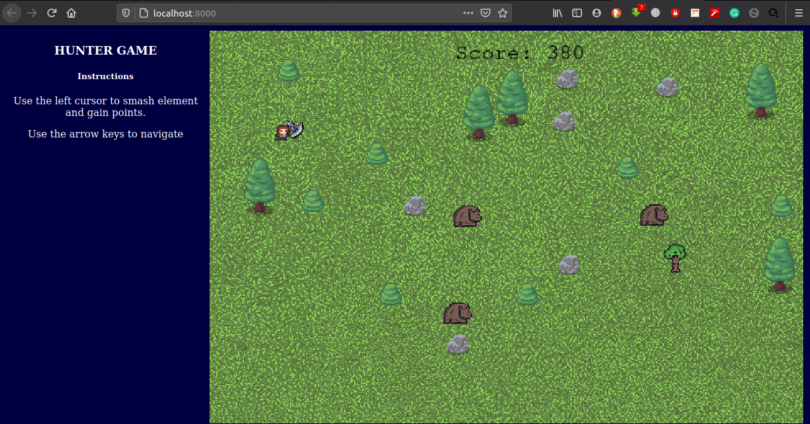
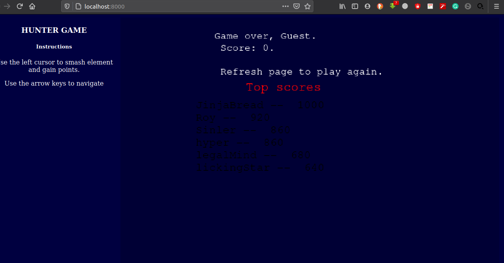

# Project: Hunting Game

This is a Hunting video game built with Javascript and the game engine [Phaser](https://phaser.io/).






## About The Project

This is a 2D Hunting game. It is only browser-based and built with Phaser 3 game engine. The player's job is to try to avoid a enemy attacks. So the player should keep smashing them as they get in close ranges. The main objective of the game is to keep the enemies at a distance and smash any that gets closer to the player. If more enemies appear in close range to the player, they overwhelm and defeat you.

For each enemy you smash, points will be added to your score. In the end, you will be added to the leaderboard if you come out among the best.


## How to play
When the game first starts;
* You are presented with the Title scene that has three buttons.
> Play button is to play the game.
> Options button directs you to the game settings
> Credits button directs to the game Inpirations and author

* With the play button, the next scene allows you to play the game as a guest, meaning that you don't have to input your name. Or Enter a a name and still play the game.

* Once the game starts on the next scene, 
> Use the right cursor key to smash through sprites and earn points/stars
> Use the arrow keys to navigate left, right, up and down.

* The  game over scene will list down all the scores of top users and your own score is displayed at the top.

* Reload the page to play again.


## Installation

To use this app locally, this is what you need to:

* [Download](hhttps://github.com/mke2111/game-rpg.git) or clone this repo:

  - Clone with HTTPS in the terminal.
  ```
    git clone https://github.com/mke2111/game-rpg.git
    
  ```
* Then `cd game-rpg` into the downloaded folder and run `npm install`
* then, run `npm run start`.

## Tests
* Run `npm run test` for the tests of the game project.

### Built With
This project was built using these technologies.
* Phaser 3 and a few of it's plugins
* JavaScript
* HTML & CSS
* Webpack
* Jest
* Leaderboard API service

## Live Version
To try the live demo [click here](https://mke2111.github.io/game-rp)


## Game Design
The game uses a number of sprites to bring all the scenes to life. User can expect well-designed animations and map textures.

### The Hunter
The hunter is usually holding a hammer that smashes through other sprites.

### The Fig
Consider this as one of the enemies

### The Bear
Consider this as one of the enemies

### The Wolf
Consider this as one of the enemies

## Future Updates
* Add a health bar
* Make mobile version
* Add Bosses

## Author

👤 **Roy Mukuye**

- GitHub: [@mke2111](https://github.com/mke2111)
- Twitter: [@Roymkenya](https://twitter.com/Roymkenya)
- LinkedIn: [Roy Mukuye](https://www.linkedin.com/in/roy-mukuye-42b07b1b4)


<!-- ACKNOWLEDGEMENTS -->
## Acknowledgements
* [Microverse](https://www.microverse.org/)
* GameDev Academy
* OpenArcade -- Youtube


## 📝 License

This project is [MIT](https://opensource.org/licenses/MIT) licensed.